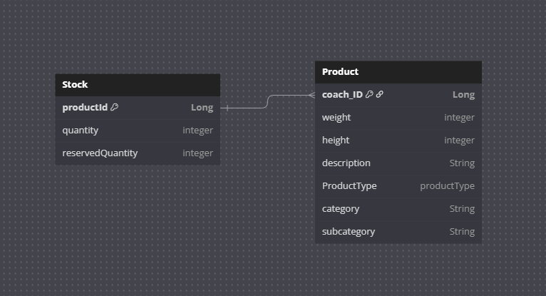

# Warehouse Product Management API

REST API do zarządzania produktami w magazynie. Aplikacja napisana w Javie z użyciem Spring Boot, Hibernate (JPA),
oraz testami jednostkowymi i integracyjnymi (JUnit + MockMvc). Aplikacja napisana z myślą o modułowości przy użyciu wzorca fabryki. 

---

## Jak uruchomić projekt

### Wymagania

- Java 17+
- Maven 3.8+
- IDE (np. IntelliJ, Eclipse) – opcjonalnie
- Docker 
### Wykres bazy danych
- 
- 